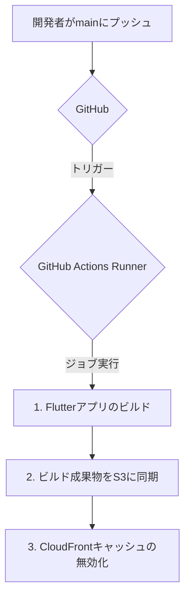

# Flutterアプリケーション AWSアーキテクチャ

このドキュメントは、FlutterウェブアプリケーションをAWSにデプロイするための、ベストプラクティスに基づいたサーバーレスアーキテクチャを概説します。

## 基本原則

- **高可用性とスケーラビリティ**: サーバー管理が不要で、トラフィックに応じて自動的にスケールします。
- **コスト効率**: 従量課金制であり、サーバーを24時間稼働させるよりも一般的に安価です。
- **パフォーマンス**: グローバルなCDN（コンテンツデリバリネットワーク）を介して、低遅延でコンテンツを配信します。
- **セキュリティ**: AWSマネージドサービスが提供する堅牢なセキュリティ機能を活用します。

## 推奨インフラ構成

| サービス | 役割 |
| :--- | :--- |
| **Amazon S3** | ビルドされた静的ウェブアセット（HTML, JS, CSS, 画像）を保管します。 |
| **Amazon CloudFront** | CDN（コンテンツデリバリネットワーク）として機能し、コンテンツをグローバルにキャッシュして低遅延で配信します。 |
| **Amazon Route 53** | （オプション）カスタムドメインとDNSルーティングを管理します。 |
| **AWS Certificate Manager** | CloudFront用の無料SSL/TLS証明書をプロビジョニング・管理し、HTTPSを有効にします。 |
| **GitHub Actions** | アプリケーションのビルドとデプロイのためのCI/CDパイプラインを自動化します。 |

## アーキテクチャ図

### 1. ユーザーアクセスフロー

```mermaid
graph TD
    A[ユーザー] --> B{Route 53 (DNS)};
    B --> C{CloudFront (CDN)};
    C --> D[S3バケット (静的ファイル)];
    E[ACM (SSL証明書)] -.-> C;
```

### 2. CI/CD デプロイフロー



## 実装ステップ

1.  **S3バケットの作成**: 静的ウェブサイトホスティング用に設定し、CloudFrontからのアクセスのみを許可するバケットポリシーで保護します（オリジンアクセスコントロールを使用）。
2.  **CloudFrontディストリビューションの作成**: S3バケットをオリジンとして設定し、ACMのSSL証明書をアタッチしてHTTPSを強制します。
3.  **Route 53の設定**（オプション）: カスタムドメインのエイリアスレコードを作成し、CloudFrontディストリビューションに向けます。
4.  **CI/CDパイプラインの構築**: `.github/workflows/aws-deploy.yml` ワークフローを使用して、`main` ブランチへのプッシュごとにデプロイプロセスを自動化します。