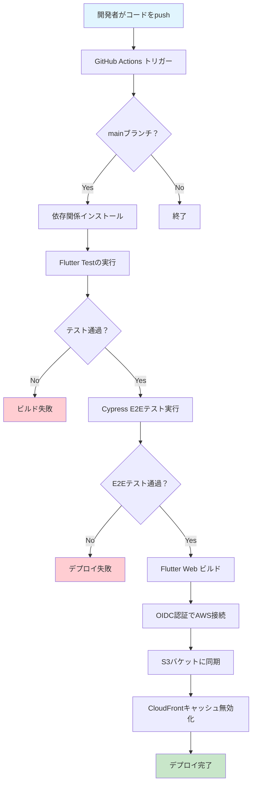
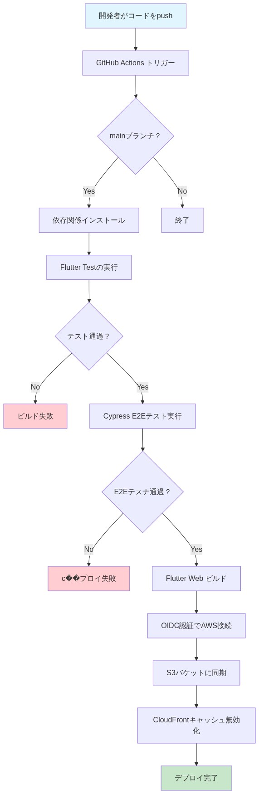

# Flutter カフェ注文アプリ

このアプリケーションは、カフェでの注文を顧客が直感的に行えるように設計されたモバイルフレンドリーな注文アプリです。Flutter によるフロントエンド開発と AWS でのサーバーレスアーキテクチャ構築のスキルを証明するために作成されました。

## 🔗 リンク

- **アプリケーション URL**: [https://d2nh2abk1vdbtw.cloudfront.net](https://d2nh2abk1vdbtw.cloudfront.net)
- **GitHub リポジトリ**: [https://github.com/shou-dev19/flutter-cafe-app-ai](https://github.com/shou-dev19/flutter-cafe-app-ai)

## 📱 アプリの UI イメージ

`./docs/cafe-app-image.png` を参照してください。

## 🚀 主な機能

### メニュー表示

- **表示形式**: メニューはカード形式で表示されます
- **カード情報**: 商品画像、商品説明文、価格、カートへ追加ボタンを含む
- **動的レイアウト**: 画面サイズに応じて、メニューカードの表示数が自動調整
- **カテゴリ別フィルタリング**: コーヒー、お茶、パスタ、サンドイッチなどのカテゴリで絞り込み

### カート機能

- **カートエリア表示**: 商品追加時にのみカートエリアを表示
- **カート内商品管理**: 商品の追加・削除、合計価格の表示
- **注文処理**: 注文確定後のカート非表示機能

## 🛠 技術スタック

### フロントエンド

- **フレームワーク**: Flutter (Web 対応)
- **状態管理**: Riverpod
- **アーキテクチャ**: Clean Architecture
- **言語**: Dart (UI: 日本語)

### バックエンド・インフラ

- **クラウド**: AWS
  - **ホスティング**: Amazon S3
  - **CDN & SSL/TLS**: Amazon CloudFront
  - **権限管理**: AWS IAM (OIDC 連携)
- **インフラ管理**: AWS CLI, Gemini CLI

### DevOps・テスト

- **CI/CD**: GitHub Actions
- **テストフレームワーク**:
  - **ユニット/ウィジェットテスト**: Flutter Test
  - **E2E テスト**: Cypress

## 🏗 システムアーキテクチャ

このアプリケーションは、スケーラビリティ、パフォーマンス、コスト効率を重視した AWS のサーバーレスアーキテクチャ上でホスティングされています。

詳細な構成図は [`AWS_ARCHITECTURE.md`](./docs/AWS_ARCHITECTURE.md) を参照してください。

### CI/CD パイプライン

GitHub Actions による自動化されたデプロイメントフローを採用しています。





#### フロー詳細:
1. **トリガー**: `main`ブランチへの`push`
2. **テスト実行**: ユニットテスト・E2Eテストの実行
3. **ビルド**: Flutter Web アプリケーションのビルド
4. **デプロイ**: 静的ファイルの S3 バケット同期
5. **キャッシュ無効化**: CloudFront キャッシュの無効化

## 📁 プロジェクト構造

```
flutter_app/
├── lib/
│   ├── data/           # データレイヤー（リポジトリ、データソース、モックデータ）
│   ├── domain/         # ビジネスロジック（エンティティ、リポジトリインターフェース、ユースケース）
│   ├── models/         # データモデル（Cart, CartItem, MenuItem）
│   ├── providers/      # Riverpod状態プロバイダー
│   └── widgets/        # UIコンポーネント
├── test/               # テストファイル
├── cypress/            # E2Eテスト
└── assets/             # 画像リソース
```

## 🚀 開発環境のセットアップ

### 前提条件

- Flutter SDK (3.3.4 以上)
- Dart SDK
- Node.js (Cypress テスト用)

### セットアップ手順

1. **依存関係のインストール**:

   ```bash
   cd flutter_app
   flutter pub get
   npm install
   ```

2. **アプリの起動**:

   ```bash
   flutter run -d web
   ```

3. **テスト実行**:

   ```bash
   # ユニットテスト
   flutter test

   # E2Eテスト
   npx cypress run
   ```

4. **ビルド**:
   ```bash
   flutter build web
   ```

## 📊 テスト戦略

### ユニット/ウィジェットテスト

- 個々のコンポーネントの機能確認
- カートプロバイダーのロジック検証
- モデルクラスの動作確認

### E2E テスト（Cypress）

- カート機能の統合テスト
- メニューフィルタリングの動作確認
- ユーザーフロー全体の検証

## 🎯 技術的なハイライト

### AWS サーバーレスアーキテクチャ

- S3 + CloudFront による高可用性ホスティング
- HTTPS 対応と CDN による高速配信
- コスト最適化されたインフラ設計

### モダンな CI/CD

- GitHub Actions によるフルオートメーション
- OIDC 認証によるセキュアな AWS 連携
- ゼロダウンタイムデプロイメント

### Clean Architecture 実装

- 関心の分離による保守性の向上
- テスト容易性を考慮した設計
- Riverpod による効率的な状態管理

### 包括的テスト戦略

- ユニットテストによる品質保証
- E2E テストによるユーザー体験の検証
- 自動化されたテストパイプライン
